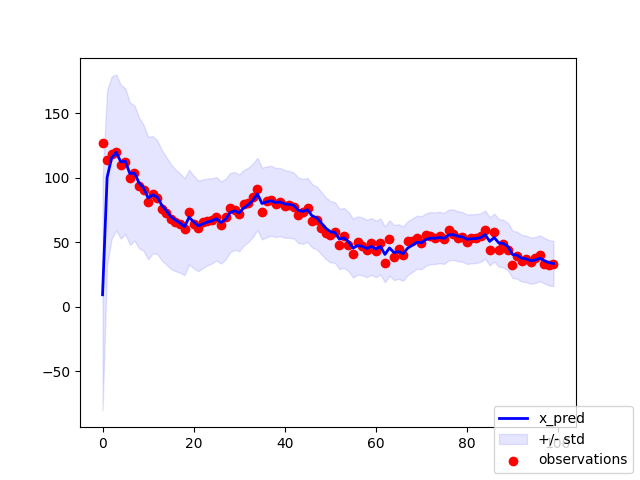

# Kalman Filter - 1D example

This notebook presents an example of a simplified Kalman filter. The filter includes obsevations for one dimentison $(x)$ and velocity $(v)$.

The Kalman filter derives its estimate of the current state based on predict and update cycle. 

## Predict step

During the predict step, Kalman filter makes a prediction where will the state transition:

$x_{t}$ = F * $x_{t-1}$

Here F is the transition matrix that captures the dynamics of the prediction:
$$
F = \left(\begin{array}{cc} 
x & ∂t\\ 
0 & v
\end{array}\right)
$$

And x captures the state:

$$
x = \left(\begin{array}{cc}
x & v
\end{array}\right)
$$

## Update step

### Error calculation

The update step takes observations $(z)$ and calculate the error $(y)$. This error affects the prediction confidence $(P)$ and the state.
$$
z = \left(\begin{array}{cc} 
x_{meas} & v_{meas}
\end{array}\right) \\
y = z - x_{t}
$$

Observations $z$ and the state $x$ might have different format / dimentionality. Therefore, to bring $x$ to the $z$ format we use observation matrix $H$. For example, if the observations $(z)$ provide only location measurement $(x$), then the observation matrix $(H)$ will have the following shape: 
$$
H = \left(\begin{array}{cc} 
1 & 0
\end{array}\right)
$$
On the other hand, if the observations provide both the location and the velocity, then we use the identity matrix: 
$$
H = \left(\begin{array}{cc} 
1 & 0 \\ 0 & 1 
\end{array}\right) \\
\\
y = z - H*x_{t}
$$

### Kalman Gain calculation

The next part is the update of the current state. The update of the current state takes the prediciton $(x_{t})$ and the error $(y)$. However, because the measurements might contain an error (for example the location measurement provided by GPS is never 100% precise), we only incorporate a portion of the error $(y)$ based on our confidence. This is achieved with the Kalman gain - $K$.

Kalman gain $(K)$ weighs in the confidence in our predictions $(P)$ vs. the confidence in the measurements $(R)$:

$$
K = P / (P + R) = P * (P + R)^{-1}
$$
Where $(P + R)^{-1}$ part is usually given a term $S$. $S$ does not carry any special meaning:
$$
S = P + R\\
K = P * S^{-1}
$$

Similarly to the transformations we applied to align $z$ and $x$, we use transition matrix $F$ to align $P$ and $S$:

$$
S = H*P*H_{T} + R\\
K = F*P*F_{T} * S^{-1}
$$

Here $H*P*H_{T}$ removes any potential covariances between diments, thus taking a strong assumpiton that the variables are independent. This assumption is a correct one. For example, if our state incorporates locaiton $x$ and velocity $v$, it is reasonable to assume that they are independent.

### State update
Once the Kalman gain $(K)$ was calculated, we can use it to update the current state:

$$
x_{t} = x_{t} + K*y
$$

### Prediciton Error update
To conclude the update, we will reevalute the prediction error - $P$ as follows:
$$
P = (1 - K) * P + Q
$$
Here $1$ is presented in the matrix format as an identity matrix - $I$:
$$
I = \left(\begin{array}{cc} 1 & 0 \\ 0 & 1\end{array}\right)
$$

And $Q$ is the the covariance of the prediction error $(y)$ - formal name is *process noise* or *motion covariance*: 
$$
Y = \left(\begin{array}{cc} y_{0} & y_{1} & ... & y_{n} \end{array}\right)\\
Q = 1/N * (Y - µ_{Y}) * (Y - µ_{Y})_{T}
$$

### Plot 1 - Observations vs Predicitons

For more details please refer to the [Jupyter Notebook](KalmanFilter1d.ipynb)
